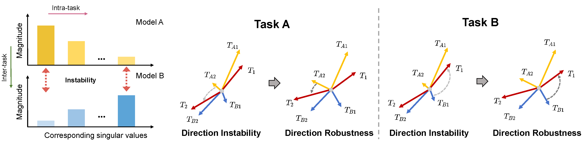

# RobustMerge: Parameter-Efficient Model Merging for MLLMs with Direction Robustness (NeurIPS 2025 Spotlight :fire:)

This repo is the official implementation of paper: **[RobustMerge: Parameter-Efficient Model Merging for MLLMs with Direction Robustness](https://arxiv.org/abs/2502.17159) [NeurIPS 2025 (Spotlight, acceptance rate: 3.1%)]**

> RobustMerge: Parameter-Efficient Model Merging for MLLMs with Direction Robustness
>
> Fanhu Zeng, Haiyang Guo, Fei Zhu, Li Shen, Hao Tang

[](https://arxiv.org/abs/2502.17159) [](https://huggingface.co/datasets/AuroraZengfh/MM-MergeBench) [](https://huggingface.co/collections/AuroraZengfh/mm-mergebench-68d15d1e884bad26f6f94972)

**Key words: Multimodal large language model, Model merging, Multi-task learning, Parameter-efficient tuning, Robust fine-tuning.**

**TL;DR: An effective parameter-efficient model merging method for multimodal large language models from the perspective of direction robustness in low-rank space**

## :newspaper: News

- **[2025.09.18]** **RobustMerge** is accepted by **NeurIPS 2025** and selected as **Spotlight** !!!! :tada:
- **[2025.08.03]** We release [fine-tuned models](https://huggingface.co/collections/AuroraZengfh/mm-mergebench-68d15d1e884bad26f6f94972) of eight seen dataset for a quick start of the benchmark! :art:
- **[2025.05.12]** We release instructions for [MM-MergeBench](https://huggingface.co/datasets/AuroraZengfh/MM-MergeBench) on Huggingface, feel free to try it! :fire:
- **[2025.04.11]** We release [Evaluation](#Evaluation) script for RobustMerge. Try it now! :fireworks:
- **[2025.02.24]** [RobustMerge](https://arxiv.org/abs/2502.17159) is available on Arxiv. :candy:

## :star2: Motivation

In parameter-efficient model merging, for a single matrix, direction for each singular value can be viewed as task specific knowledge in low-rank space and the magnitude of singular value is the extent to which the knowledge is utilized in current task. **_Left_:** Stark singular values exist within task, leading to instability when merging between tasks. **_Right_**: As directions of large singular value are naturally robust, direction instability are more likely to happen for small values when merging specific singular vector.

## :classical_building: Structure
<div align="center">
  
</div>

**Mitigating gap between singular values is effective for high-performance merged model**: We prune ineffective parameters and construct scaling coefficients from inter-parameter relation directly on LoRA components to mitigate interference between tasks aroused from stark singular values difference. Additionally, we perform cross-task normalization to balance tasks of different data scales and enhance unseen task generalization.


## :rocket: Quick Start

### Install
Like [LLaVA](https://github.com/haotian-liu/LLaVA), install the packages following the steps below:

1. Clone this repository
```bash
git clone https://github.com/AuroraZengfh/RobustMerge.git
cd RobustMerge
```

2. Install Package
```Shell
conda create -n robustmerge python=3.10 -y
conda activate robustmerge
pip install --upgrade pip
pip install -e .
```

3. Install additional packages for training cases
```
pip install -e ".[train]"
pip install flash-attn --no-build-isolation
```

### Model Preparation

Create `models` folder, donwload base model [LLaVA](https://github.com/haotian-liu/LLaVA) and put the checkpoint in the folder.

### Data and Instruction Preparation

-- Create `datasets` folder and download all dataset needed for merging.

-- Create `instructions` folder and download all the instructions needed for merging.


For the constructed mllm merging benchmark including both datasets and instructions, you can find them in [MM-MergeBench](https://huggingface.co/datasets/AuroraZengfh/MM-MergeBench). Details of image sources for the datasets are listed as below:

**Seen datasets for merging**

| Dataset | Image Source   | Download Path  |
|  :----:  | :----:  |  :----:  |
|  ScienceQA | ScienceQA | [images](https://drive.google.com/drive/folders/1w8imCXWYn2LxajmGeGH_g5DaL2rabHev) |
| VizWiz | VizWiz | [images](https://opendatalab.org.cn/OpenDataLab/VizWiz-Captions) | 
| ImageNet | ImageNet | [images](https://image-net.org/challenges/LSVRC/index.php) | 
| VQAv2, REC | COCO2014 | [images](http://images.cocodataset.org/zips/train2014.zip) |
| IconQA | IconQA | [images](https://iconqa2021.s3.us-west-1.amazonaws.com/iconqa_data.zip) | 
| Flickr30k | Flickr30k | [images](https://github.com/BryanPlummer/flickr30k_entities) | 
| OCRVQA | OCRVQA | [images](https://drive.google.com/drive/folders/1_GYPY5UkUy7HIcR0zq3ZCFgeZN7BAfm_) |


**Unseen datasets for merging**

| Dataset | Image Source   | Download Path  |
|  :----:  | :----:  |  :----:  |
| AOKVQA | COCO2014 | [images](http://images.cocodataset.org/zips/val2014.zip) |
| ImageNet-R | ImageNet-R | [images](https://people.eecs.berkeley.edu/~hendrycks/imagenet-r.tar) | 
| Screen2words | Screen2words  | [images](https://huggingface.co/datasets/pinkmooncake/rico-screen2words) |
| TabMWP | TabMWP | [images](https://github.com/lupantech/PromptPG/tree/main/data/tabmwp)| 


You can also formulate your custom data and place them in the folder.

### Training
Follow standard parameter-efficient fine-tuning procedure in [LLaVA](https://github.com/haotian-liu/LLaVA) to obtain individual checkpoints for each dataset.

### Evaluation

You can alternate the foundation model according to your need.

e.g., take llava-v1.5-7b as an example

1. Evaluate direct fine-tuned model

```
sh scripts/eval_merge/Eval_direct.sh
```

2. Merge direct fine-tuned model

```
sh scripts/merge/merge_lora.sh
```

3. Evaluate merged model

```
sh scripts/eval_merge/Eval_merge.sh
```

**Note**:
- '/path/to/your-fined-model' in `Eval_direct.sh` and `merge_lora.sh` is the root folder of direct fine-tuned chekpoint
- '/path/to/yout/merged/checkpoint' in `merge_lora.sh` and `Eval_merge.sh` is the folder of merged checkpoint

### Fine-tuned Model weights
We provide [model weights](https://huggingface.co/collections/AuroraZengfh/mm-mergebench-68d15d1e884bad26f6f94972) on these eight datasets with LoRA fine-tuned for 1 epoch to empower a quick start.

| Dataset | Fine-tuned Model Weights|
|  :----:  | :----: |
|  ScienceQA | [model-path](https://huggingface.co/AuroraZengfh/LLaVA_7B_lora_r16_ScienceQA) |
| VizWiz | [model-path](https://huggingface.co/AuroraZengfh/LLaVA_7B_lora_r16_VizWiz) | 
| ImageNet | [model-path](https://huggingface.co/AuroraZengfh/LLaVA_7B_lora_r16_ImageNet)| 
| VQAv2 | [model-path](https://huggingface.co/AuroraZengfh/LLaVA_7B_lora_r16_VQAv2) |
| REC | [model-path](https://huggingface.co/AuroraZengfh/LLaVA_7B_lora_r16_REC) |
| IconQA | [model-path](https://huggingface.co/AuroraZengfh/LLaVA_7B_lora_r16_IconQA)  | 
| Flickr30k | [model-path](https://huggingface.co/AuroraZengfh/LLaVA_7B_lora_r16_flickr30k) | 
| OCRVQA | [model-path](https://huggingface.co/AuroraZengfh/LLaVA_7B_lora_r16_OCRVQA)  |

## :blue_book: Citation
If you find this work useful, consider giving this repository a star :star: and citing :bookmark_tabs: our paper as follows:

```bibtex
@article{zeng2025parameter,
  title={RobustMerge: Parameter-Efficient Model Merging for MLLMs with Direction Robustness},
  author={Zeng, Fanhu and Guo, Haiyang and Zhu, Fei and Shen, Li and Tang, Hao},
  journal={arXiv preprint arXiv:2502.17159},
  year={2025}
}
```

## Acknowledgememnt

The code is based on  [LLaVA](https://github.com/haotian-liu/LLaVA), [TIES-Merging](https://github.com/prateeky2806/ties-merging). Thanks for these great works and open sourcing! 

If you find them helpful, please consider citing them as well. 
